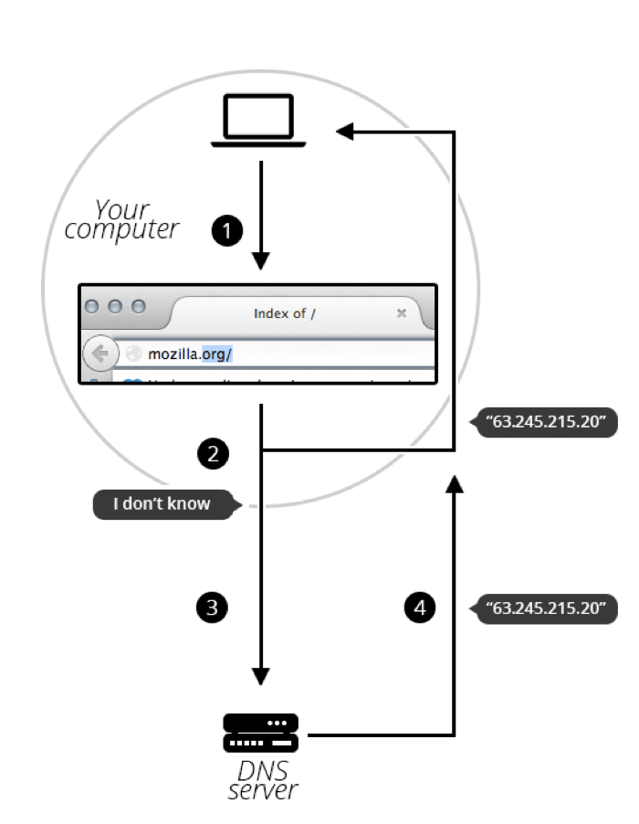

# Domain Name Nedir?

Alan adları (Domain Name), internet altyapısının en önemli bileşenlerinden biridir.  
İnternette bulunan herhangi bir web sunucusu için **insan tarafından okunabilir bir adres** sağlar.

Kullanıcılar, web sitelerine erişirken karmaşık IP adresleri yerine alan adlarını kullanır.

### Örnek Alan Adları : 
- www.google.com
- www.github.com
- www.btkakademi.com

İnternete bağlı herhangi bir bilgisayara veya sunucuya **IP adresi** aracılığıyla erişilebilir. Bu adresler iki farklı sürümde olabilir.
- **IPv4:** `192.0.2.172`
- **IPv6:** `2001:db8:8b73:0000:0000:8a2e:0370:1337`

IP adresleri insanlar tarafından hatırlanması zor olan sayısal ve karmaşık yapılardır. Ayrıca bu adresler, altyapı değişiklikleri veya sunucu taşıma işlemleri nedeniyle zamanla değişebilir.

Bu sebeple, internet üzerinde erişim kolaylaştırmak amacıyla alan adları (Domain Names) geliştirilmiştir. Alan adları, IP adreslerinin yerine geçen ve kullanıcıların web sitelerine daha kolay, hızlı ve akılda kalıcı bir şekilde ulaşmasını sağlayan mantıksal adreslerdir.

## ALAN ADLARININ YAPISI
Alan adları, noktalarla ayrılmış birden fazla parçadan oluşur ve sağdan sola okunur. Bu yapı, alan adının hiyerarşik olarak sınıflandırılmasını sağlar.

Bir alan adını oluşturan her parça (etiket), alan adının tamamı hakkında özel ve anlamlı bilgiler sunar.

# TLD (Top-Level Domain / Üst Düzey Alan Adı)
TLD, alan adının en sağında bulunan ve alan adının hangi kategoriye veya amaca hizmet ettiğini belirten bölümdür.
**Örneğin :**
- **.com :** Ticari
- **.org :** Organizasyonlar
- **.net :** Ağ servisleri

Bazı TLD’ler herhangi bir kullanım kısıtlamasına sahip değildir. Genel TLD’ler web hizmetlerinin belirli bir kriteri karşılamasını zorunlu kılmaz.
Ancak bazı TLD’ler daha katı kayıt politikalarına sahiptir. Bu tür alan adları, kullanıldıkları amaca göre daha net bir anlam ifade eder. 
**Örneğin :** 
- **.edu :** Eğitim kurumları
- **.gov :** Devlet kurumları

**TLD’ler :** 
- Hem Latin karakterler hem de özel karakterler (IDN / Internationalized Domain Names) içerebilir
- Bir TLD maksimum uzunluğu 63 karakterdir, pratikte çoğunlukla 2-3 karakter uzunuluğundadır.

# SLD (Second Level Domain / İkincil Seviye Alan Adı)
SLD, TLD’nin hemen solunda yer alan etikettir ve genellikle alan adının asıl ismini temsil eder.
SLD, genellikle :
- Marka adı
- Kurum adı
- Proje veya servis adı olarak belirlenir
**Örneğin :**
- google.com
    - **google :** SLD
    - **.com :** TLD

## ALAN ADI ETİKETLERİ (LABELS)
Bir alan adı birden fazla etiketten (bileşenden) oluşabilir. Alan adı oluşturmak için belirli sayıda etiket zorunluluğu yoktur. 
Yani bir alan adının geçerli olabilmesi için mutlaka 3 etiket içermesi gerekmez.

Geçerli bir alan adı örneği:
- informatics.ed.ac.uk
    - Bu alan adında
        - **.uk :** TLD
        - **ac :** akademik kurumları temsil eden alt alan
        - **ed :** eğitim alanı
        - **informatics :** alt alan (subdomain)
        - Bu yapı alan adlarının hiyerarşik ve esnek bir şekilde oluşturulabildiğini gösterir.

## DOMAIN NAME NEDEN GEREKLİDİR?
- **Hatırlanabilirlik ve Kullanım Kolaylığı**
    - Alan adlarının en temel gerekliliği kolay hatılanabilir olmalarıdır.
    - Web sitelerine kolay erişim
    - Yanlış adres yazma ihtimali azalır
    - İnternet kullanımı daha pratik hale gelir
- **IP Adreslerinin Değişebilir Olması**
    - IP adresleri sabit olmak zorunda değildir. Sunucu taşınabilir, değiştirilebilir, yedeklenebilir.
    - Bu durumda Ip adresi değişse bile alan adı aynı kalır ve kullanıcılar değişikliği fark etmez.
- **Markalaşma ve Kurumsal Kimlik**
    - Alan adları yalnızca teknik değil aynı zamanda markalaşma aracıdır.
    - **Örneğin :** 
        - www.trendyol.com
        - www.amazon.com
    - Bu alan adları markayı temsil eder, güven oluşturur, profesyonel bir imaj sağlar.
- **Güvenlik ve Sertifikalar (HTTPS / SSL)**
    - **HTTPS :** veri güvenliği sağlar, kullanıcı bilgilerini korur
    - **SSL :** alan adına tanımlanır, IP adresine tanımlanamaz
- **Servislerin Ayrıştırılabilmesi (Subdomain Kullanımı)**
    - Alan adları sayesinde farklı servisler ayrıştırılabilir, tek IP üzerinde birden fazla servis çalışabilir.
    - **Örneğin :** 
        - www.site.com
        - blog.site.com
        - api.site.com
- **DNS ve Trafik Yönetimi**
    - Alan adları DNS sayesinde Yük Dengeleme (Load Balancing), Yedekleme (Failover), Trafik Yönlendirme gibi işlemlerin yapılmasına olanak tanır.

## SUBDOMAİN NEDİR?
**Subdomain (Alt Alan Adı),** bir alan adının ana alan adına bağlı olarak oluşturulan alt bölümleridir. Subdomain’ler ana alan adının soluna eklenerek oluşturulur ve genellikle farklı servisleri veya bölümleri ayırmak için kullanılır.

Subdomain’ler DNS üzerinden ayrı ayrı yapılandırılabilir ve farklı sunuculara yönlendirilebilir.
- **Genel Yapı :**
    - subdomain.domain.tld
- **Örneğin :**
    - blog.example.com
    - **blog :** subdomain
    - **example :** SLD
    - **.com :** TLD 

### Subdomain Ne Amaçla Kullanılır?
Büyük veya orta ölçekli web projelerinde düzen, yönetim ve ölçeklenebilirlik sağlar.

**Yaygın kullanım amaçları :**
- Farklı içerikleri ayırmak
- Ayrı uygulamaları aynı domain altında çalıştırmak 
- Teknik servisleri izole etmek

**Yaygın subdomain örnekleri :**
- www.site.com      → Ana web sitesi
- blog.site.com     → Blog sayfaları
- api.site.com      → API servisi
- admin.site.com    → Yönetim paneli
- mail.site.com     → Mail servisi

**Subdomain ile DNS İlişkisi**
- Subdomainler DNS kayıtları üzerinden tanımlanır.
- Tek IP üzerinden birden fazla servis çalıştırılabilir
- Yük dengeleme ve yönlendirme yapılabilir

**Subdomain ile Klasör Farkı**
- Subdomain, DNS seviyesinde ayrı bir adres olarak çalışır
- Klasör, aynı uygulamanın bir parçasıdır.
- Subdomain farklı sunucuya yönlendirilebilir, klasör yönlendirilemez.
- **Klasör :** site.com/blog
- **Subdomain :** blog.site.com

**Subdomain Kullanmanın Avantajları**
- Servisleri birbirinden ayırır
- Yönetimi kolaylaştırır
- Büyük projelerde performans sağlar
- Güvenlik ve erişim kontrolü yapılabilir
- API ve frontend ayrımı desteklenir

## DOMAIN NAME NASIL ÇALIŞIR?
Bir kullanıcı tarayıcıya bir alan adı yazdığında tarayıcı bu adresin hangi sunucuya ait olduğunu doğrudan bilemez. Çünkü bilgisayarlar ve ağ cihazları, alan adlarıyla değil IP adresleriyle iletişim kurar.

Bu noktada DNS (Domain Name System) devreye girer.

DNS, alan adlarını IP adreslerine çeviren dağıtık ve hiyerarşik bir sistemdir. İnternetin “telefon rehberi” olarak da düşünülebilir.

*`Alan adının DNS üzerinden IP adresine çözülme süreci`*

## DNS (DOMAIN NAME SYSTEM) NEDİR?
İnsanların kullandığı alan adlarını, makinelerin anlayabildiği IP adreslerine dönüştüren sistemdir.

Bu sistem sayesinde kullanıcılar karmaşık IP adreslerini bilmeden web sitelerin erişebilir.

### Alan Adı Çözümleme (DNS Resolution) Süreci
Bir alan adı yazıldığında, DNS çözümleme süreci belirli adımlar izleyerek gerçekleşir. 
- **Tarayıcı ve İşletim Sistemi Kontrolü**
    - Tarayıcı önbelleği (cache)
    - İşletim sistemi önbelleği kontrol edilir. Eğer alan adı daha önce çözülmüşse IP adresi buradan alınır.
- **Recursive DNS Sunucusuna Sorgu**
    - Önbellekte kayıt yoksa, istek internet servis sağlayıcısının (ISP) Recursive DNS sunucusuna gönderilir.
- **Root DNS Sunucusu**
    - Recursive DNS sunucusu, alan adının hangi üst düzey alan adına (.com, .org vb.) ait olduğunu öğrenmek için root DNS sunucularına başvurur.
- **TLD DNS Sunucusu**
    - Root DNS sunucusu, alan sdının ilgili TLD DNS sunucusunun adresini döndürür.
    - **Örneğin :**  .com uzantısı için .com TLD sunucusu.
- **Yetkili (Authoritative) DNS Sunucusu**
    - TLD DNS sunucusu, alan adının yetkili DNS sunucusunun adresini verir.
    - Yetkili DNS sunucusu, alan adına karşılık gelen gerçek IP adresini tutar.
- **IP Adresinin Alınması**
    - Alan adına ait IP adresi bulunur ve Recursive DNS sunucusuna iletilir.
- **Web Sunucusuna Bağlantı**
    - Tarayıcı elde edilen IP adresine HTTP veya HTTPS isteği gönderir ve web sitesi kullanıcıya gösterilir.

### DNS’in Dağıtık Yapısı ve Avantajları
DNS merkezi bir sistem değildir. Dünya genelinde dağıtılmış sunucular üzerinde çalışır. 

Bu yapı sayesinde:
- Hızlı erişim sağlanır
- Arıza durumlarında sistem çalışmaya devam eder
- Yük dengeleme (Load Balancing) yapılabilir
- Yedekleme ve yönlendirme (Failover) mümkündür

### DNS Kayıt Türleri
- DNS sunucuları alan adlarıyla ilgili bilgileri farklı kayıt türleriyle saklar:
    - **A RECORD :** Alan adını IPv4 adresine yönlendiri.
    - **AAAA RECORD :** Alan adını IPv6 adresine yönlendirir
    - **CNAME RECORD :** Bir alan adını başka bir alan adına yönlendirir
    - **MX RECORD :** Alan adına ait e-posta sunusularını belirtir

## DOMAIN İLE HOSTİNG ARASINDAKİ FARK
**Domain (alan adı)** ve **hosting (barındırma hizmeti)**, bir web sitesinin çalışabilmesi için birlikte kullanılan ancak farklı görevleri olan iki temel bileşendir. Bu iki kavram sıklıkla karıştırılsa da işlevleri birbirinden tamamen farklıdır.

### Domain (Alan Adı) Nedir ?
- Domain, bir web sitesinin internetteki adresidir. Kullanıcıların web sitesine ulaşmasını sağlar.
- Kullanıcı tarafından yazılır
- DNS aracılığıyla IP adresine yönlendirili
- Web sitesinin kimliğini ve adını temsil eder.
### Hosting Nedir?
- Hosting bir web sitesine ait HTML, CSS, JS, Resimler, Veritabanı, Uygulama dosyaları gibi tüm içeriklerin saklandığı sunucu hizmetidir.
- Hosting olmadan web sitesi dosyaları barındırılamaz ve sunucu, kullanıcılara yanıt veremez.
### Domain ve Hosting Nasıl Birlikte Çalışır?
- Bir web sitesinin yayında olması için : 
    - Domain satın alınır
    - Hosting hizmeti alınır
    - Domain - Hosting’e yönlendirilir
    - DNS ayarları yapılır
    - Web sitesi erişilebilir olur
- Bu yönlendirme genellikle Nameserver veya A Record üzerinden yapılır.

## DOMAIN ve HOSTİNG ARASINDAKİ TEMEL FARKLAR
| Domain | Hosting |
|------|---------|
| Web sitesinin adresidir | Web sitesinin bulunduğu yerdir |
| DNS ile IP adresine yönlenir | IP adresine sahiptir |
| Kullanıcı tarafından görülür | Arka planda çalışır |
| Satın alınır | Kiralanır |
| Kimliktir | Kaynaktır |