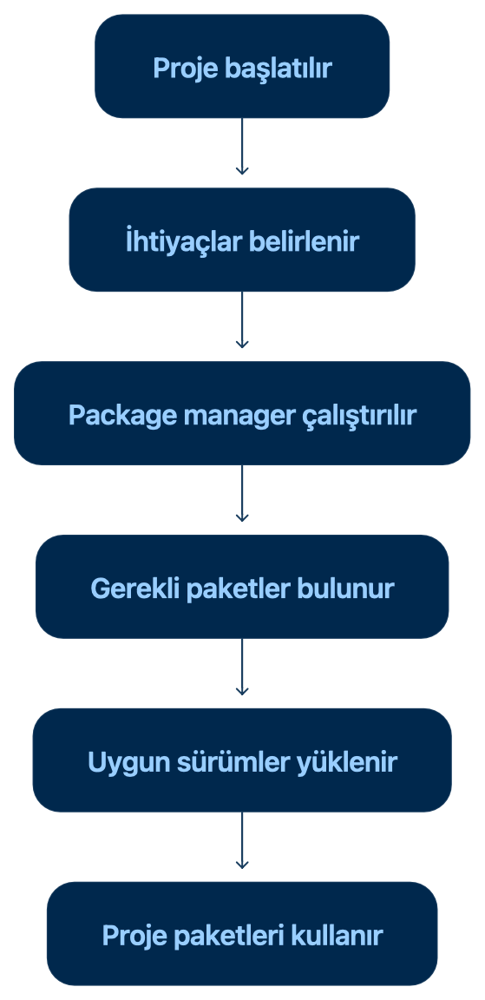
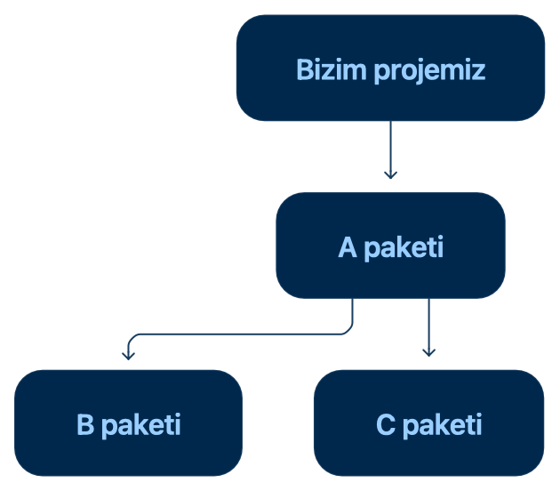
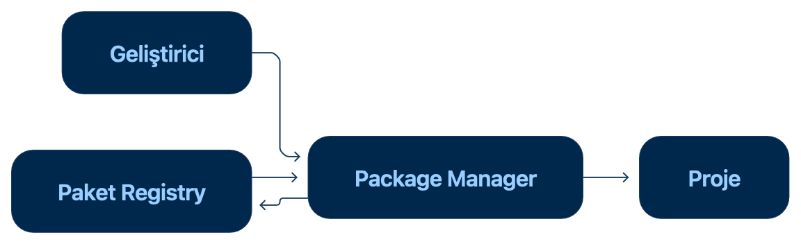

# Package Manager Nedir?

**Package Manager**, Türkçede **paket yöneticisi** anlamına gelir.

Bir yazılım projesinde ihtiyaç duyulan dış kaynaklı araçların ve kod kütüphanelerinin yönetilmesini sağlayan programdır.

En basit tanımıyla:
`Package Manager, bir projede kullanılan paketleri yükleyen, kaldıran, güncelleyen ve sürümlerini takip eden araçtır.`

Javascript dünyasında en çok kullanılan package manager'lar şunlardır:
- npm
- Yarn
- pnpm

Bunların dışında `Bun` da paket yönetimi yapabilir. Ancak başlangıçta npm, Yarn ve pnpm arasındaki mantığı öğrenmek yeterlidir.

## Package Manager Neden Gereklidir?
Eskiden geliştiriciler ihtiyaç duydukları kodları veya kütüphaneleri internetten manuel olarak indirip projelerine ekliyordu.
Örneğin bir projede tarih işlemleri yapmak için dışarıdan bir kütüphane kullanmak istediğimizi düşünelim. Package manager bulunmasaydı genel olarak şu işlemleri yapmamız gerekebilirdi:
- Kütüphanenin internet sitesini bulmak
- Doğru sürümünü indirmek
- Dosyaları proje içerisine kopyalamak
- Kütüphanenin ihtiyaç duyduğu başka araçları araştırmak
- Güncelleme geldiğinde dosyaları yeniden indirmek
- Eski dosyaları kaldırıp yenileriyle değiştirmek
- Projeyi başka bilgisayarda açarken aynı işlemleri tekrarlamak

Bu yöntem küçük projelerde mümkün görünse de proje büyüdükçe yönetilmesi zorlaşır.

Package manager bu işlemlerin büyük bölümünü bizim yerimize gerçekleştirir.

Örneğin `npm install`komutu çalıştırıldığında npm, projenin ihtiyaç duyduğu bağımlılıkları tespit eder ve uygun sürümleri yükler.

## Günlük Hayattan Bir Benzetme
Package manager'ı bir **market alışveriş uygulaması** gibi düşünebiliriz.

Bir yemek hazırlayacağımızı ve tarifte şu malzemelerin bulunduğunu düşünelim.
- Un
- Süt
- Yumurta
- Şeker

Burada:
| Yazılım kavramı     | Günlük hayattaki karşılığı        |
| ------------------- | --------------------------------- |
| Proje               | Hazırlayacağımız yemek            |
| Paket               | Malzeme                           |
| Paket listesi       | Alışveriş listesi                 |
| Package manager     | Alışverişi yapan uygulama         |
| Paket kayıt sistemi | Market                            |
| Paket sürümü        | Ürünün belirli çeşidi veya modeli |

Package manager alışveriş listesini okur, gerekli malzemeleri ilgili kaynaktan bulur ve bize getirir.

Yazılım projesinde de benzer bir süreç gerçekleşir:



## Package Manager Ne Yapar?
Bir package manager'ın temel görevlerini ayrı ayrı inceleyelim.

### 1.Paket Yükler
Projede ihtiyaç duyulan bir araç veya kütüphane package manager aracılığıyla yüklenebilir.

Örneğin npm kullanılıyorsa:
```
    npm install paket-adi
```

Yarn kullanıyorsa:
```
    yarn add paket-adi
```

Pnpm kullanıyorsa:
```
    pnpm add paket-adi
```

Bu komutların yazım şekilleri farklı olsa da temel amaçları aynıdır; projeye yeni bir paket eklemek.

### 2.Paket Kaldırır
Artık kullanılmayan paketleri projeden kaldırabilir.
```
    npm uninstall paket-adi
```
Bu işlem yalnızca ilgili dosyaları silmekle kalmaz, projenin paket listesinde bulunan ilgili kaydı da günceller.

### 3.Paketleri Günceller
Projede kullanılan paketlerin daha yeni sürümlerini kontrol edebilir ve uygun olanları güncelleyebilir.
```
    npm update
```
Ancak paket güncellemek her zaman yalnızca bu komutu çalıştırmaktan ibaret değildir. Yeni sürümlerde projeyi etkileyen değişiklikler bulunabilir. Bu nedenle özellikle büyük projelerde güncellemeler kontrollü yapılmalıdır.

### 4.Bağımlılıkları Yönetir
Bir paket, çalışabilmek için başka paketlere ihtiyaç duyabilir.

Örneğin projemize A isimli bir paket eklediğimizi düşünelim. Ancak A paketi kendi içinde B ve C paketlerini kullanıyor olabilir.



Biz yalnızca A paketini yüklemek isteriz. Package manager ise A paketinin ihtiyaç duyduğu B ve C paketlerini de tespit ederek yükler.

Bu işleme genel olarak **dependency resolution,** yani **bağımlılık çözümleme** denir.

### 5.Sürümleri Takip Eder
Paketlerin zaman içinde farklı sürümleri yayımlanır. Örneğin bir paketin şu sürümleri bulunabilir:
```
    1.0.0
    1.1.0
    1.1.1
    2.0.0
```

Package manager, projenin hangi sürümü kullanması gerektiğini belirler ve bu bilgiyi proje dosyaları üzerinden takip eder.

Bunun önemli bir nedeni vardır: Aynı proje farklı bilgisayarlarda açıldığında herkesin mümkün olduğunca aynı paket sürümleriyle çalışması gerekir.

Aksi takdirde şöyle bir durum yaşanabilir:
`Proje benim bilgisayarımda çalışıyor ama başka bilgisayarda çalışmıyor.`
Package manager ve onun oluşturduğu kilit dosyaları bu tür farklılıkların azaltılmasına yardımcı olur.

### 6.Proje Komutlarını Çalıştırır
JavaScript projelerinde package manager’lar yalnızca paket yüklemek için kullanılmaz. Projede tanımlanan komutları çalıştırmak için de kullanılabilir.

Örneğin:
```
    npm run dev
```
veya:
```
    yarn dev
```
Bu komutlar geliştirme ortamını başlatabilir.

Benzer şekilde projeye göre şu komutlarla karşılaşabiliriz:
```
    npm run build
    npm run lint
    npm run test
```

Bu komutların tam olarak ne yapacağı proje içerisinde tanımlanır.

Bu nedenle package manager, projenin geliştirme komutlarına ulaşmamızı sağlayan bir arayüz gibi de çalışır.

## Package Manager Nasıl Çalışır?
JavaScript projesinde genel çalışma süreci şu şekildedir:
- Package manager proje bilgilerini okur
- Projenin ihtiyaç duyduğu paketleri tespit eder
- Paketlerin hangi sürümlerinin kullanılacağını belirler
- Paketleri bir kayıt sisteminden indirir
- İndirilen paketleri projede kullanılabilir hale getirir
- Projenin paket ve sürüm kayıtlarını günceller

Bu süreçte genellikle üç önemli yapıyla karşılaşırız:
| Yapı           | Görevi                           |
| -------------- | -------------------------------- |
| `package.json` | Proje ve paket bilgilerini tutar |
| Lock dosyası   | Kesin paket sürümlerini kaydeder |
| `node_modules` | Yüklenen paketleri barındırır    |

Kullanılan package manager'a göre lock dosyasının adı değişir:
| Package manager | Lock dosyası        |
| --------------- | ------------------- |
| npm             | `package-lock.json` |
| Yarn            | `yarn.lock`         |
| pnpm            | `pnpm-lock.yaml`    |

## Paketler Nereden İndirilir?
Package manager ile paket kayıt sistemi aynı şey değildir.

Bu ayrımı anlamak önemlidir:
- **Package Manager:** Paketleri yöneten araçtır.
- **Package Registry:** Paketlerin yayımlandığı ve saklandığı sistemdir.

Javascript dünyasında en yaygın kayıt sistemi `npm Registry`' dir.

npm, Yarn ve pnpm genellikle paketleri npm Registry üzerinden indirebilir.
Süreç basitleştirilmiş olarak şöyledir:



Örneğin Yarn kullanmamız, paketlerin mutlaka Yarn’a ait ayrı bir marketten indirildiği anlamına gelmez. Yarn da çoğu durumda npm Registry’de yayımlanmış paketlere ulaşır.

## Package Manager, Node.js ve npm Aynı Şey Midir?
Hayır. Bu kavramlar birbiriyle ilişkili olsa da aynı değildir.

**Node.js**
JavaScript kodlarının tarayıcı dışında, örneğin bilgisayarımızda veya bir sunucuda çalıştırılmasını sağlayan çalışma ortamıdır.

**npm**
JavaScript projelerinde kullanılan bir package manager’dır. Node.js kurulumuyla birlikte genellikle npm de kurulur.

**npm Registry**
JavaScript paketlerinin yayımlandığı çevrim içi kayıt sistemidir.

Kısaca:
| Kavram       | Görevi                                 |
| ------------ | -------------------------------------- |
| Node.js      | JavaScript’i çalıştırır                |
| npm CLI      | Paketleri ve proje komutlarını yönetir |
| npm Registry | Paketleri saklar ve dağıtır            |

Buradaki **CLI, Command Line Interface,** yani **komut satırı arayüzü** anlamına gelir.

Terminalde yazdığımız şu komut npm’in komut satırı aracını çalıştırır:
```
    npm install
```

## Her Programlama Dilinde Aynı Package Manager Mı Kullanılır?
Hayır. Programlama dilleri ve ekosistemleri farklı package manager'lara sahip olabilir.

| Ekosistem            | Yaygın package manager |
| -------------------- | ---------------------- |
| JavaScript / Node.js | npm, Yarn, pnpm        |
| .NET                 | NuGet                  |
| Python               | pip, Poetry            |
| PHP                  | Composer               |
| Java                 | Maven, Gradle          |
| Ruby                 | RubyGems               |
| Rust                 | Cargo                  |

Sen JavaScript, React ve Next.js projelerinde çoğunlukla npm, Yarn veya pnpm ile karşılaşacaksın.

ASP.NET Core projelerinde ise benzer ihtiyacı karşılayan sistem olarak NuGet karşına çıkar.

Araçların komutları ve dosya yapıları farklı olsa da temel amaç aynıdır:

`Projenin dış bağımlılıklarını düzenli, takip edilebilir ve tekrar kurulabilir şekilde yönetmek.`

## Bir Projede Birden Fazla Package Manager Kullanılabilir Mi?
Teknik olarak bazı durumlarda mümkün olsa da aynı proje içerisinde farklı package manager'ları karışık kullanmak önerilmez.

Örneğin bir projede şu dosya bulunuyorsa `yarn.lock`bu proje büyük olasılıkla Yarn ile yönetiliyordur.

Aynı projede daha sonra `npm install` çalıştırılırsa npm ayrıca şu dosyayı oluşturabilir `package-lock.json`. Bu durumda projede iki farklı lock dosyası oluşabilir.
```
    yarn.lock
    package-lock.json
```

Bu iki package manager bağımlılıkları farklı şekilde çözebileceği için ekip üyelerinin bilgisayarlarında farklı sonuçlar ortaya çıkabilir.

Genel kural şudur:
`Proje hangi package manager ile oluşturulduysa ekip tarafından aynı package manager kullanılmalıdır.`

Örneğin projede:
```
{
  "packageManager": "yarn@4.18.0"
}
```
bilgisi bulunuyorsa projenin Yarn'ın belirtilen sürümüyle çalıştırılması beklenir.

## Package Manager ile Paket Arasındaki Fark
Bu iki kavram sık karıştırılır.

**Package Manager** Paketleri yöneten araçtır.
Örnek:
```
    npm
    Yarn
    pnpm
```

**Paket** Başka geliştiriciler veya ekipler tarafından hazırlanmış, projede kullanılabilen kod bütünüdür.

Örnek olarak `React, TypeScript veya ESLint` birer paket olarak projeye eklenebilir.

Kısa bir benzetmeyle:
```
    Package manager kargo şirketiyse paket, kargo şirketinin taşıdığı kutudur.
```

## Package Manager Kullanmanın Sağladığı Avantajlar
Package manager kullanmak:
- Paketlerin kolayca yüklenmesini sağlar
- Kullanılmayan paketlerin düzenli şekilde kaldırılmasını sağlar
- Paket sürümlerinin takip edilmesini kolaylaştırır.
- Bir paketin ihtiyaç duyduğu diğer paketleri otomatik olarak bulur.
- Projenin başka bilgisayarlarda yeniden kurulabilmesini sağlar.
- Ekip üyelerinin benzer geliştirme ortamlarında çalışmasına yardımcı olur.
- Güncelleme işlemlerini daha düzenli hâle getirir.
- Proje komutlarının ortak bir yapı üzerinden çalıştırılmasını sağlar.
- Manuel dosya indirme ve kopyalama ihtiyacını azaltır.

## Package Manager Ne Değildir?
Konuyu netleştirmek için package manager’ın ne olmadığını da bilmeliyiz.

Package manager:
- JavaScript’in kendisi değildir.
- Node.js ile aynı şey değildir.
- Kod editörü değildir.
- Git veya GitHub değildir.
- Tek başına uygulama geliştirmez.
- Paketlerin tutulduğu registry ile aynı şey değildir.
- Uygulamanın kaynak kodunun yerine geçmez.
Package manager, geliştirme sürecinde kullanılan yardımcı ve yönetici bir araçtır.