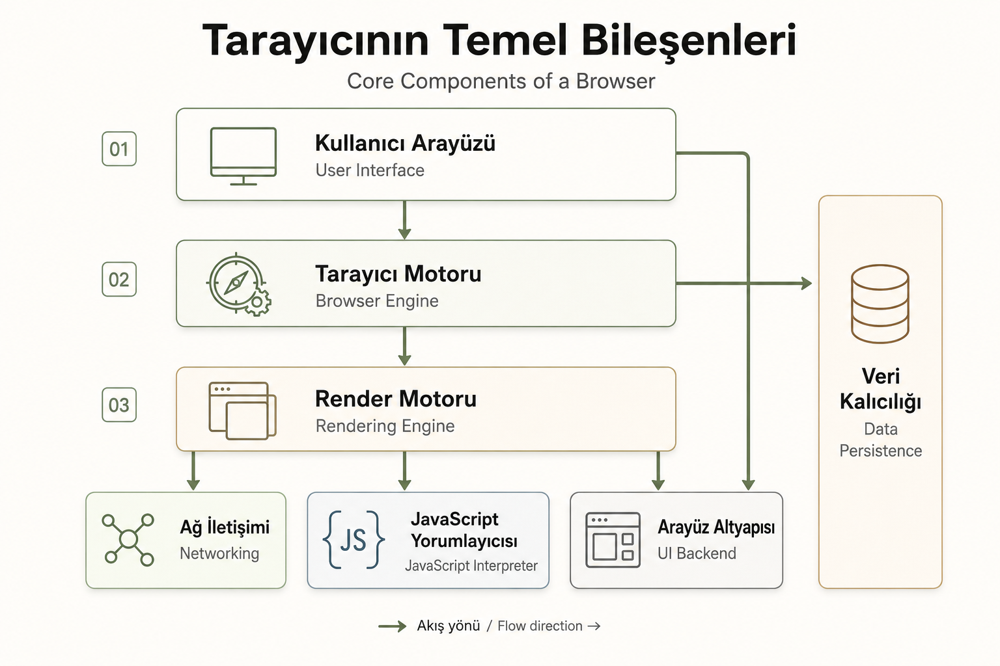

# Tarayıcı Nedir ve Nasıl Çalışır?

## Tarayıcı Nedir?

**Tarayıcı (browser)**, internetteki web sitelerini görmemizi sağlayan programdır.

Tarayıcının ana işlevi seçtiğiniz web kaynağını sunucudan isteyip tarayıcı penceresinde göstermektir. Kaynak genelde bir HTML belgesidir ancak pdf, resim, veya başka içerik türü de olabilir.

Günümüzde masaüstünde kullanılan 5 ana temel tarayıcı vardır :
- Chrome
- Internet Explorer
- Firefox
- Safari
- Opera

Mobil cihazlarda kullanılan tarayıcılar:
- **Android cihazlarda:**
    - Chrome
    - Opera
- **Iphone cihazlarda:**
    - Safari
    - Chrome

| TARAYICI    | MOTOR  | AÇIKLAMA   |
|-------------|--------|------------|
|Chrome, Edge |Blink   |Chromium tabanlı modern motor|
|Firefox      |Gecko   |Mozilla tarafından geliştirilmiştir|
|Safari       |WebKit  |Apple cihazlarında kullanılır|
|Edge (eski)  |EdgeHTML|Artık kullanılmıyor|

## Tarayıcı Nasıl Çalışır?
**- Adres Girilir:** Adresin gerçek adı URL (Üniforma Resource Locator) ‘dir. *Örn : www.google.com*

**- DNS Sorgusu:** Tarayıcı bu Url’nin hangi sunucuya ait olduğunu anlamak ister. Bunun için DNS sunucusuna gider.

**- İsteği Gönderme:** Tarayıcı Ip adresine gidip sitenin anasayfasını ister. Bu işlem HTTP / HTTPS protokolü ile yapılır.

**- Cevap Alınır:** Sunucu tarayıcıya paket gönderir. Html, css, js dosyaları resimler.

**- Tarayıcı Sayfayı Çizer:** Tarayıcı aldığı bu kodları bir araya getirerek sayfayı çizer.
- HTML ile iskeleti kurar. CSS ile süsler. Js ile sayfaya can verir.

## Tarayıcıların Temel Bileşenleri Nelerdir?

**- Kullanıcı Arayüzü (User Interface):** Kullanıcının tarayıcıyla etkileşim kurduğu tüm bölümdür. Adres çubuğu, geri-ileri butonları, yer imleri çubuğu, sekmeler, sayfa yükleniyor çubuğu.

**- Tarayıcı Motoru (Browser Engine):** Kullanıcı arayüzü ile oluşturma motoru arasında köprü görevi görür.
    - Kullanıcının yaptığı işlemleri alır bunları oluşturma motoruna iletir, sayfanın nasıl görünmesi gerektiğini oluşturma motoruna bildirir.

**- Oluşturma Motoru (Rendering Engine):** Html, css gibi web sayfası kodlarını alır, işler ve kullanıcıya görsel bir sayfa olarak gösterir.
- HTML ve CSS kodlarını ayrıştırır (parse eder)
- Görsel bir yapıya dönüştürür (render)
- Sayfanın son halini çizer
- **Örn :** **`<h1>Merhaba</h1>`** Tarayıcıda büyük ve kalın **Merhaba** yazısı olarak görünür.

**- Ağ (Network) :** Tarayıcının internete bağlanıp gerekli dosyaları indirdiği bileşendir.
- HTML, CSS, JS dosyalarını sunucudan getirir.
- AJAX ve fetch gibi istekleri yönetir.
- HTTP / HTTPS protokolleriyle çalışır.

**- Kullanıcı Arayüzü Arka Ucu (UI Backend) :** Tarayıcının butonlar, kaydırma çubuğu, menüler gibi arayüz elemanlarını çizmesini sağlayan grafik altyapısıdır.
- İşletim sistemine uygun grafik elementlerini çizer.
- Arayüzün görünmesini sağlar (sistem tuşları, kutular vs.)

**- Javascript Yorumlayıcısı (Javascript Interpreter) :** Web sayfasındaki js kodlarını çalıştıran motor.
- Animasyonlar, butona tıklaman, form kontrolü gibi şeyleri sağlar.
- Js kodlarını yorumlar ve çalıştırır.

**- Veri Depolama (Data Persistence) :**  Kullanıcıların bilgilerini geçici ya da kalıcı olarak saklamak için kullanılan sistem. Sayfalar arasında bilgi taşımayı veya sayfanın daha hızlı yüklenmesini sağlar.
- Çerezler (Cookies)
- LocalStorage
- IndexedDB
- Cache (Önbellek)

## Tarayıcıların Veri Depolama Yöntemleri Nelerdir?

**- Çerezler (Cookies) :** Tarayıcının küçük veri parçalarını sakladığı dosyalardır. Oturum bilgileri tercih ayarları veya kullanıcı kimlikleri gibi küçük bilgiler saklanır.
- Yaklaşık 4KB
- Otomatik olarak her istekte sunucuya gönderilir.
- Geçici (session) veya Kalıcı (persistent) olarak süreleri belirlenir.
- Js ile okunabilir ve yazılabilir : document.cookie 
- Giriş yapmış kullanıcıyı hatırlamak için kullanılır.
- Dil tercihi, tema gibi ayarları korumak için kullanılır.
- Ziyaretçinini davranışlarını izlemek için kullanılır.

**- LocalStorage (Yerel Depolama) :** Js ile tarayıcıda kalıcı veri depolamaya yarayan daha modern bir teknolojidir. Sayfa kapatılsa bile veri silinmez.
- Yaklaşık 5-10MB boyutu vardır tarayıcıya göre değişir.
- Sunucuya gönderilmez.
- Veriler kalıcıdır, kullanıcı silene kadar tarayıcıda kalır.
- Yalnızca aynı domain tarafından erişilebilir.
- Js ile kullanılır.
- Şifre gibi hassas bilgilerin tutulması için uygun değildir. 

**- IndexedDB :** Tarayıcı içinde büyük ve karmaşık verileri saklamak uygun bir veritabanıdır. Web uygulamalarında çevrimdışı çalışma desteği sağlar.
- Yüksek MB’larca veri saklanabilir.
- Nesne tabanlı veri saklama 
- Anahtar-değer (key-value) yapısı vardır
- Asenkron çalışır (Veriye erişmek zaman alabilir.)
- Daha karmaşık Api
- Şifre gibi hassas bilgilerin tutulması için uygun değildir.

**- Cache (Önbellek) :** Web sayfalarının bazı dosyalarını geçici olarak tarayıcıda saklar. (HTML, CSS, JS, resim) Sayfayı daha hızlı açmak ve sunucu yükünü azaltmak için kullanılır.
- Sayfa hızını artırma, çevrimdışı kullanım, mobil veri tüketiminin azalmasını sağlar.
- **HTTP Cache :** Response header bilgilerine göre içerikler otomatik olarak saklanır.
- **Service Worker Cache (Cache API) :** Js ile yönetilen önbellek.

## Geliştirici Araçları (F12) Nedir?
- Tarayıcıda F12 tuşuna basarak ya da sağ tıklayıp İncele veya Öğeyi Denetle diyerek araçlara ulaşılmakta. 
- Web geliştiriciler kodlarını burada test eder, hata ayıklar.
- Tasarımcılar anlık Css değişiklikleriyle tasarım düzenlemeleri yapar.
- Her modern tarayıcının geliştirici araçları vardır :
    - **Google Chrome:** Chrome DevTools
    - **Mozilla Firefox:** Firefox Developer Tools
    - **Microsoft Edge:** Edge DevTools
    - **Safari:** Web Inspector
- **Elements (Öğeler) Paneli:** HTML ve CSS yapısını gösterir. Html yapısını tıklayarak inceleyebilir ve css özelliklerini anlık olarak değiştirilebilir.
- **Console (Konsol) Paneli:** Javascript kodlarının çalıştırılabildiği yerdir.
    - Hataları (error), uyarıları (warning) ve bilgi mesajlarını gösterir.
- **Source (Kaynaklar) Paneli:** Js, Css dosyaların kaynaklarına ulaşılır. Kodların görünmesini sağlayarak hata ayıklama için breakpoint koyularak incelenmektedir. 
- **Ağ (Network) Paneli:** Ağ etkinliğini görüntüleyen paneldir. Hangi sayfalar ne kadar sürede indirildiği detaylı bir şekilde gösterilmektedir. 
    - API’den veri çekildiği zaman buradan izlenebilmektedir.
- **Application (Uygulama) Paneli:** IndexedDB veya Web Sql veritabanları, yerel ve oturum depolaması, çerezler, uygulama önbelleği, görüntüler, yazı tipleri, stil sayfaları dahil olmak üzere yüklenen tüm kaynaklar incelenmektedir.
- **Performance (Performans) Paneli:** Yük ve çalışma zamanı performansını iyileştirmek için kullanılır. Ne kadar sürede yüklendiği ve hangi işlemlerin yavaşladığını analiz eder.
- **Lighthouse:** Sayfanın hız, erişilebilirlik, SEO gibi konulardaki puanını verir. Siteyi daha iyi hale getirmek için öneriler sunar.
- **Security (Güvenlik):** Karma içerik sorunları, sertifika sorunları ve daha fazlasında hata ayıklayın. Sayfanın Https olup olmadığını analiz eder.
- **Memory (Bellek) Paneli:** Sayfa performansını etkileyen bellek sorunları bulunur. Sayfanın ne kadar RAM kullandığını gösterir.

## Kaynakça
- **Web.dev:** https://web.dev/articles/howbrowserswork?hl=tr
- **Medium:** https://medium.com/sahibinden-technology/web-tarayıcılar-nasıl-çalışır-e71c77710419 
- **Chrome DevTools:** https://developer.chrome.com/docs/devtools/overview?hl=tr#start 