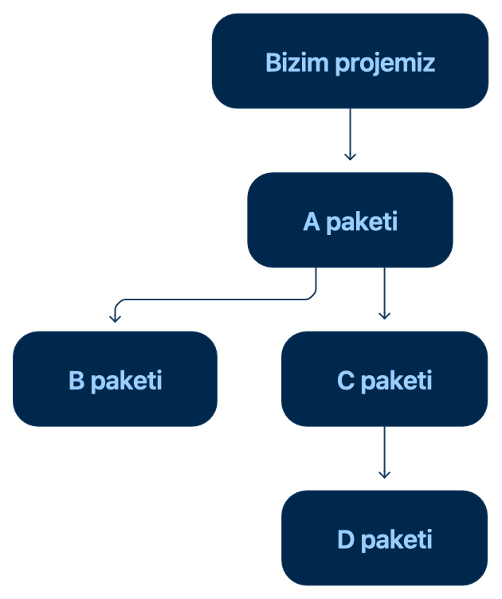
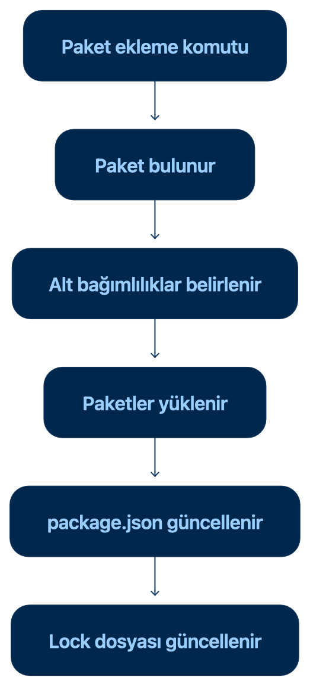

# Bağımlılık (Dependency) Nedir?

Bir yazılım projesinin çalışmak, geliştirmek, test edilmek veya derlenmek için ihtiyaç duyduğu dış paketlere bağımlılık, yani **dependency** denir.

En temel tanımıyla:
`Bağımlılık, projenin ihtiyaç duyduğu başka bir paketle arasındaki ilişkidir.`

Örneğin bir projede Zod paketini kullanıyorsak:
```
    import { z } from "zod";
```
Bu projenin çalışabilmesi için `zod`paketine ihtiyacı vardır. Bu nedenle Zod, projenin bir bağımlılığıdır.

## Paket ve Bağımlılık Aynı Şey Mi?
Paket ve Bağımlılık birbiriyle ilişkili ancak farklı kavramlardır.

| Kavram     | Açıklama                                                   |
| ---------- | ---------------------------------------------------------- |
| Paket      | Kurulabilir ve dağıtılabilir kod bütünüdür                 |
| Bağımlılık | Projenin bir pakete ihtiyaç duyduğunu ifade eden ilişkidir |

Örneğin `zod`, npm Registry üzerinde yayımlanan bir pakettir.

Bu paketi projemize ekleyip kurmaya başladığımızda `zod`, projemizin **dependency? No. bağımlılığı olur.**

Kısaca:
`Her bağımlılık bir pakettir, ancak registry’de bulunan her paket bizim projemizin bağımlılığı değildir.`

## Günlük Hayattan Bağımlılık Benzetmesi
Bir pasta yapmak istediğimizi düşünelim. Pastanın hazırlanabilmesi için:
- Un
- Yumurta
- Süt
- Şeker

gibi malzemelere ihtiyaç vardır.

Bu örnekte:
| Günlük hayat                         | Yazılım             |
| ------------------------------------ | ------------------- |
| Pasta                                | Proje               |
| Malzemeler                           | Paketler            |
| Pastanın malzemelere ihtiyaç duyması | Bağımlılık ilişkisi |
| Malzemeleri temin eden sistem        | Package manager     |

- Un tek başına bir üründür. Ancak pasta yaparken gerekli olduğu için pastanın bir bağımlılığı haline gelir.
- Benzer şekilde Zod tek başına bir pakettir. Proje Zod'u kullanmaya başladığında proje ile Zod arasında bir bağımlılık ilişkisi oluşur.

## Bir Proje Neden Bağımlılıklara İhtiyaç Duyar?
Bir projede ihtiyaç duyulan her özelliği sıfırdan geliştirmek mümkün olabilir. Ancak bu yaklaşım çoğu zaman verimli değildir.

Bağımlılıklar sayesinde:
- Hazır ve test edilmiş çözümler kullanılabilir.
- Geliştirme süresi kısalır.
- Karmaşık özellikler daha kolay oluşturulur.
- Kod tekrarının önüne geçilebilir.
- Ortak standartlar uygulanabilir.
- Projenin geliştirme ve test süreçleri kolaylaştırılabilir.

Örneğin bir Next.js projesi aşağıdaki paketlere ihtiyaç duyabilir:
```
    next
    react
    react-dom
    zod
    typescript
    eslint
```

Bu paketlerin görevleri birbirinden farklıdır:
| Bağımlılık   | Projedeki görevi                                         |
| ------------ | -------------------------------------------------------- |
| `next`       | Next.js uygulamasının temel yapısını sağlar              |
| `react`      | Kullanıcı arayüzünün oluşturulmasını sağlar              |
| `react-dom`  | React bileşenlerinin web ortamında gösterilmesini sağlar |
| `zod`        | Verilerin doğrulanmasını sağlar                          |
| `typescript` | Tip kontrolü ve geliştirme desteği sağlar                |
| `eslint`     | Kod kalitesini ve kurallarını denetler                   |

## Doğrudan ve Dolaylı Bağımlılıklar
Bağımlılıklar yalnızca projeye bizim eklediğimiz paketlerden oluşmaz. Eklediğimiz paketlerin de başka paketlere ihtiyacı olabilir.

Bu nedenle bağımlılıklar iki temel gruba ayrılır:
1. Doğrudan Bağımlılık
2. Dolaylı Bağımlılık

### 1. Doğrudan Bağımlılık
Projeye doğrudan eklediğimiz ve proje kodunda kullandığımız paketlere doğrudan bağımlılık denir.

İngilizce olarak: `Direct Dependency`

Örneğin projeye Zod eklediğimizi düşünelim:
```
    npm install zod
```

Ardından kod içerisinde kullanalım:
```
    import { z } from "zod";

    const userSchema = z.object({
    name: z.string(),
    age: z.number()
    });
```

Burada Zod’u doğrudan biz ekledik ve proje kodunda kullandık. Bu nedenle zod, projenin doğrudan bağımlılığıdır.

Bu paket genellikle `package.json` dosyasında görünür:
```
    {
    "dependencies": {
        "zod": "^4.0.0"
    }
    }
```

Buradaki sürüm yalnızca örnek olarak verilmiştir. Paket sürümlerini ileride ayrı bir başlıkta inceleyeceğiz.

### 2. Dolaylı Bağımlılık
Doğrudan kullandığımız bir paketin ihtiyaç duyduğu diğer paketlere dolaylı bağımlılık denir.

Bunlar için şu ifadelerde kullanılabilir:
```
    Transitive dependency
    Alt bağımlılık
    Geçişli bağımlılık
```

Örneğin projemize A paketini eklediğimizi düşünelim. Ancak A paketi çalışmak için B ve C paketlerine ihtiyaç duyuyor olabilir:



Bu yapıda:
- A, projenin doğrudan bağımlılığıdır.
- B ve C, projenin dolaylı bağımlılıklarıdır.
- D, C paketinin bağımlılığıdır ve yine dolaylı bağımlılık sayılır.

Biz yalnızca A paketini seçmiş olabiliriz. Package manager, A paketinin ihtiyaç duyduğu diğer paketleri de belirleyerek yükler.

### Bağımlılık Ağacı Nedir?
Bir projenin paketler arasındaki bağlantılarını gösteren yapıya bağımlılık ağacı denir.

İngilizce karşılığı: `Dependency tree`

Basit bir örnek:
```
    proje
    ├── paket-a
    │   ├── paket-b
    │   └── paket-c
    └── paket-d
        └── paket-e
```

Bu yapıda:
- paket-a ve paket-d doğrudan bağımlılıklardır.
- paket-b, paket-c ve paket-e dolaylı bağımlılıklardır.

Gerçek projelerde bağımlılık yapısı çok daha büyük olabilir. Birkaç doğrudan paket eklenmesine rağmen yüzlerce dolaylı paket yüklenebilir.

## Dolaylı Bağımlılıklar Neden Önemlidir?
Dolaylı bağımlılıkları biz doğrudan seçmemiş olsak da bunlar projenin bir parçası hâline gelir.

Bu paketler:
- Güvenlik açığı içerebilir.
- Paket boyutunu artırabilir.
- Kurulum süresini etkileyebilir.
- Başka paketlerle sürüm uyuşmazlığı yaşayabilir.
- Güncelleme sırasında projeyi etkileyebilir.

Bu nedenle bir paket seçerken yalnızca paketin kendisi değil, ihtiyaç duyduğu alt bağımlılıklar da değerlendirilmelidir.

## Kullanım Amaçlarına Göre Bağımlılıklar
Bir proje, her pakete aynı amaçla ihtiyaç duymaz.

Bazı paketlere uygulama çalışırken, bazılarına ise yalnızca geliştirme sırasında ihtiyaç duyulur.

JavaScript projelerinde en sık karşılaşılan bağımlılık türleri şunlardır:
- dependencies
- devDependencies
- peerDependencies
- optionalDependencies

Başlangıç seviyesinde en önemli iki tür `dependencies` ve `devDependencies` alanlarıdır.

### 1. dependencies
Uygulamanın çalışması için ihtiyaç duyduğu paketler `dependencies` alanında tutulur.

Örneğin:
```
    {
    "dependencies": {
        "next": "^16.0.0",
        "react": "^19.0.0",
        "react-dom": "^19.0.0",
        "zod": "^4.0.0"
    }
    }
```
Buradaki paketler uygulamanın çalışma koduyla doğrudan ilişkilidir.

Örneğin:
```
    import { z } from "zod";
```
uygulama çalışırken Zod’un sunduğu özellik kullanılır. Bu nedenle Zod genellikle bir çalışma bağımlılığıdır.

Yaygın örnekler:
- React
- Next.js
- Zod
- Axios
- Swiper
- Form yönetim araçları
- Kullanıcı arayüzü bileşenleri

### 2. devDependencies

Yalnızca projeyi geliştirirken, kontrol ederken, test ederken veya derlemeye hazırlarken kullanılan paketler `devDependencies` alanında tutulur.

`dev`, development, yani geliştirme kelimesinin kısaltmasıdır.

Örneğin:
```
    {
    "devDependencies": {
        "typescript": "^5.0.0",
        "eslint": "^9.0.0"
    }
    }
```
Bu paketlere genellikle şu işlemler sırasında ihtiyaç duyulur:
- TypeScript tip kontrolü,
- Kod kalitesi denetimi,
- Otomatik test,
- Kod biçimlendirme,
- Geliştirme araçlarının çalıştırılması.

Yaygın örnekler:
- TypeScript
- ESLint
- Prettier
- Test araçları
- TypeScript tür paketleri
- Geliştirme ve derleme yardımcıları

Uygulamanın son kullanıcısı doğrudan ESLint kullanmaz. ESLint, geliştiricinin kodu kontrol etmesine yardımcı olur. Bu nedenle geliştirme bağımlılığı olarak eklenir.

**dependencies ve devDependencies farkı**
| Özellik                   | `dependencies`        | `devDependencies`                                   |
| ------------------------- | --------------------- | --------------------------------------------------- |
| Temel amaç                | Uygulamanın çalışması | Uygulamayı geliştirmek ve kontrol etmek             |
| Ne zaman kullanılır?      | Uygulama kodunda      | Geliştirme, test ve kontrol sırasında               |
| Örnek                     | React, Zod, Swiper    | TypeScript, ESLint, Prettier                        |
| Üretim ortamıyla ilişkisi | Genellikle gereklidir | Çoğu zaman yalnızca geliştirme sürecinde gereklidir |

En basit ayrım:
```
    Uygulama çalışırken ihtiyaç duyulanlar **dependencies**, uygulama geliştirilirken ihtiyaç duyulanlar **devDependencies** alanına eklenir.
```

Ancak modern frontend projelerinde derleme süreci nedeniyle bazı araçların hangi gruba ait olacağı projenin dağıtım yöntemine göre değişebilir. Bu nedenle paketin resmî kurulum dokümantasyonu da kontrol edilmelidir.

**Bir Bağımlılık Yanlış Alana Eklenirse Ne Olur?**
Uygulamanın çalışması için gerekli bir paket yanlışlıkla `devDependencies` alanına eklenirse geliştirme ortamında sorun görülmeyebilir.

Ancak üretim ortamında yalnızca `dependencies` paketleri yükleniyorsa uygulama gerekli paketi bulamayabilir: `Module not found`

Benzer şekilde yalnızca geliştirme sırasında kullanılan her paketi `dependencies` alanına eklemek de bağımlılık listesinin gereksiz yere büyümesine neden olabilir.

Bu yüzden paketin projedeki görevi doğru belirlenmelidir.

### 3.peerDependencies
Bir paketin, başka bir ana paketle birlikte ve belirli sürüm aralıklarında çalışmasının beklendiğini belirtmek için `peerDependencies` kullanılır.

Türkçede **eş bağımlılık** şeklinde ifade edilebilir.

Bu alanla özellikle kendi kütüphanesini, eklentisini veya yeniden kullanılabilir bileşen paketini geliştiren kişiler karşılaşır.

Örneğin bir React bileşen kütüphanesi şu bilgiyi taşıyabilir:
```
    {
    "peerDependencies": {
        "react": "^19.0.0"
    }
    }
```
Bu ifade şu anlama gelir:
```
    Bu paket React ile birlikte çalışır ve belirtilen React sürümüyle uyumludur.
```
Bileşen kütüphanesinin kendi içine farklı bir React kopyası eklemesi yerine, paketi kullanan projenin uygun React sürümüne sahip olması beklenir.

Uygun sürüm bulunmadığında package manager bir uyumluluk uyarısı veya kurulum hatası gösterebilir.

**peerDependencies Neden Kullanılır?**

Bir React bileşen paketinin kendi React kopyasını getirdiğini düşünelim. Ana projede de başka bir React sürümü bulunuyor olabilir:
```
    Ana proje
    ├── react 19
    └── component-library
        └── react 18
```

Aynı projede React'ın birden fazla ve uyumsuz kopyasının bulunması beklenmeyen sorunlara neden olabilir.

`peerDependencies`, paketin ana projedeki ortak React kurulumunu kullanmasını ve hangi sürümlere uyumlu olduğunu sağlar.

Başlangıç seviyesinde bilmemiz gereken temel tanım şudur:
```
    `peerDependices`, bir paketin birlikte çalışmayı beklediği ana paketleri ve desteklediği sürümleri açıklar.
```

### 4.optionalDependencies
Bir paketin çalışmasına yardımcı olan ancak bulunmaması durumunda kurulumun tamamen başarısız olmasının istenmediği bağımlılıklar `optionalDependencies` alanında belirtilebilir.

`optional`, isteğe bağlı anlamına gelir.

Örneğin bir paket belirli işletim sistemlerinde ek bir özellik sunuyor olabilir. Bu paket yüklenemediğinde ana uygulama temel özellikleriyle çalışmaya devam edebilir.

```
    {
    "optionalDependencies": {
            "ornek-ek-paket": "^1.0.0"
        }
    }
```

Bu bağımlılık türü günlük frontend geliştirmede `dependencies` ve `devDependencies` kadar sık kullanılmaz. Ancak bir projenin bağımlılık yapısını incelerken karşımıza çıkabilir.

## Bağımlılıklar Nerede Kaydedilir?
Bir JavaScript projesinin doğrudan bağımlılıkları genellikle `package.json` dosyasında kaydedilir.

Örneğin:
```
    {
        "dependencies": {
            "react": "^19.0.0",
            "zod": "^4.0.0"
        },
        "devDependencies": {
            "typescript": "^5.0.0",
            "eslint": "^9.0.0"
        }
    }
```

Bu örnekte:
- React ve Zod çalışma bağımlılığıdır.
- TypeScript ve ESLint geliştirme bağımlılığıdır.
- Paket adlarının karşısındaki ifadeler sürüm bilgileridir.

`package.json` dosyasının bütün alanlarını bir sonraki ana başlıkta ayrıntılı olarak inceleyeceğiz.

## package.json Paketleri İçinde Barındırır Mı?
Hayır.

`package.json` dosyası paketlerin kodlarını içinde saklamaz. Projenin hangi paketlere ihtiyaç duyduğunu kaydeder.

Örneğin:
```
    {
        "dependencies":{
            "zod":"^4.0.0"
        }
    }
```

Bu kayıt Zod'un bütün kaynak kodunun `package.json` içinde bulunduğu anlamına gelmez.

`package.json` yalnızca şu bilgiyi taşır:
```
    Bu proje Zod paketine ihtiyaç duyuyor.
```

Package manager bu bilgiyi okur, uygun paketi registry'den bulur ve projeye yükler.

## Bir Bağımlılık Projeye Nasıl Eklenir?
Bir paket package manager ile projeye eklendiğinde genel olarak şu işlemler gerçekleşir:
- Package manager paket kayıt sistemine ulaşır.
- İstenen paketin uygun sürümünü bulur.
- Paketin kendi bağımlılıklarını inceler.
- Gerekli doğrudan ve dolaylı bağımlılıkları belirler.
- Paketleri projeye yükler.
- Bağımlılık bilgilerini proje dosyalarına kaydeder.
- Kesin sürüm sonuçlarını lock dosyasına yazar.



Bu işlemin ayrıntıları kullanılan npm, Yarn veya pnpm’e göre farklılık gösterebilir.

## Bağımlılık Sürümü Neden Önemlidir?
Bir paketin zaman içnde farklı sürümleri yayımlanabilir:
```
    1.0.0
    1.1.0
    1.1.1
    2.0.0
```

Proje belirli bir sürümün davranışlarına göre geliştirilmiş olabilir. Kontrolsüz bir güncelleme:
- Mevcut fonksiyonları değiştirebilir.
- Eski özellikleri kaldırabilir.
- Yeni hatalara neden olabilir.
- Başka paketlerle uyumsuzluk oluşturulabilir.

Bu yüzden projede yalnızca hangi paketin kullanıldığı değil, hangi sürüm aralığının kabul edildiği de kaydedilir.

Sürüm numaralarını ve `^`, `~` işaretlerini Semantic Versioning bölümünde ayrıntılı inceleyeceğiz.

## Bağımlılık Çakışması Nedir?
İki paket aynı alt paketin farklı ve birbiriylr uyumsuz sürümlerine ihtiyaç duyabilir.

Örneğin:
```
    Proje
    ├── Paket A
    │   └── Paket C 1.x
    └── Paket B
        └── Paket C 2.x
```

Bu durumda:
- Paket A, Paket C’nin 1.x sürümüne,
- Paket B, Paket C’nin 2.x sürümüne

ihtiyaç duyar.

Package manager bu bağımlılık ağacını çözmeye çalışır. Gerektiğinde aynı paketin farklı sürümlerini ayrı konumlarda yükleyebilir.

Ancak bazı durumlarda sürümler birlikte çalışamaz ve aşağıdakine benzer uyarılar görülebilir:
```
    dependency conflict
    peer dependency conflict
    incompatible version
```

Bu tür bir sorun yaşandığında paketi zorla yüklemek her zaman doğru çözüm değildir. Öncelikle hangi paketlerin hangi sürümlere ihtiyaç duyduğu incelenmelidir.

## Bağımlılıklar Neden Güvenlik Riski Oluşturabilir?
Projeye eklenen her bağımlılık, başka geliştiriciler tarafından hazırlanmış kodların proje içerisinde kullanılmasına neden olur.

Bir doğrudan bağımlılık çok sayıda dolaylı bağımlılık getirebilir:
```
    Proje
    └── Doğrudan paket
        ├── Alt paket A
        ├── Alt paket B
        └── Alt paket C
```

Bu zincirdeki paketlerden birinde güvenlik açığı bulunması projeyi etkileyebilir.

Bu nedenle:
- Kullanılmayan bağımlılıklar kaldırılmalıdır.
- Paketler güvenilir kaynaklardan seçilmelidir.
- Güvenlik uyarıları incelenmelidir.
- Güncellemeler kontrollü yapılmalıdır.
- Paket adlarının doğruluğu kontrol edilmelidir.
- Lock dosyaları korunmalıdır.
- Zorla kurulum seçenekleri bilinçsizce kullanılmamalıdır.

Her yeni bağımlılık projeye özellik kazandırırken aynı zamanda bakım sorumluluğu da ekler.

## Kullanılmayan Bağımlılıklar Neden Kaldırılmalıdır?
Projede artık kullanılmayan bir paketin kayıtlı kalması:
- Bağımlılık ağacını gereksiz büyütebilir
- Kurulum süresini uzatabilir
- Güvenlik uyarılarına neden olabilir
- Projenin hangi paketlere gerçekten ihtiyaç duyduğunu belirsizleştirebilir
- Güncelleme ve bakım yükünü artırabilir

Bir paketin koddan silinmesi, bağımlılık kaydının otomatik olarak kaldırıldığı anlamına gelmez.

Örneğin şu kullanım silinmiş olabilir:
```
    import Swiper from "swiper";
```
Ancak `swiper` hala `package.json`içinde kayıtlı olabilir. Böylr bir durumda paket, package manager'ın kaldırma komutu kullanılarak projeden tamamen çıkarılmalıdır.

## Bağımlılık Seçerken Temel Yaklaşım
Bir paketi bağımlılık olarak eklemeden önce şu sorular sorulmalıdır:
- Bu pakete gerçekten ihtiyacımız var mı?
- Özelliği daha basit bir şekilde geliştirebilir miyiz?
- Paket güvenilir mi?
- Bakımı devam ediyor mu?
- Projeyle uyumlu mu?
- Hangi alt bağımlılıkları getiriyor?
- Güvenlik açığı bulunuyor mu?
- İleride kaldırılması veya değiştirilmesi zor olacak mı?

Bağımlılık sayısının az olması tek başına kaliteli proje göstergesi değildir. Önemli olan her bağımlılığın bilinçli bir nedenle eklenmesidir.

## Kısa Özet
**Bağımlılık**, bir projenin çalışmak veya geliştirilmek için ihtiyaç duyduğu pakettir.

Bağımlılıklar kullanım ilişkilerine göre ayrılabilir:
| Bağımlılık türü        | Açıklaması                                            |
| ---------------------- | ----------------------------------------------------- |
| Doğrudan bağımlılık    | Projeye bizim eklediğimiz paket                       |
| Dolaylı bağımlılık     | Eklediğimiz paketlerin ihtiyaç duyduğu paket          |
| `dependencies`         | Uygulamanın çalışması için gereken paketler           |
| `devDependencies`      | Geliştirme ve kontrol sırasında gereken paketler      |
| `peerDependencies`     | Bir paketin birlikte çalışmayı beklediği ana paketler |
| `optionalDependencies` | Bulunması yararlı ancak zorunlu olmayan paketler      |

En önemli ilişki şu şekilde özetlenebilir:
```
    Package manager → paketleri yönetir
    Paket → kurulabilir kod bütünüdür
    Bağımlılık → projenin ihtiyaç duyduğu pakettir
``` 